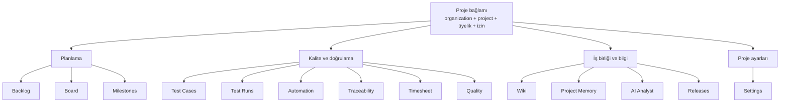
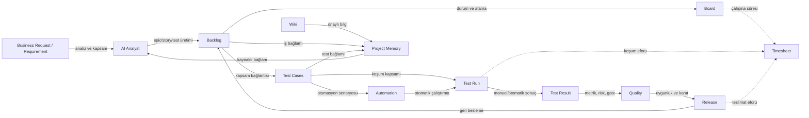
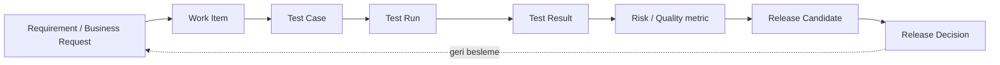
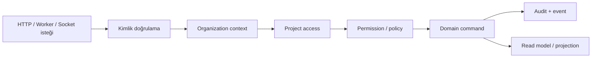
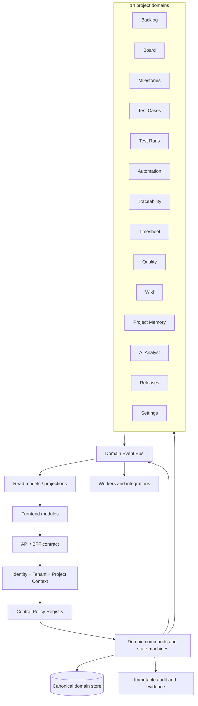
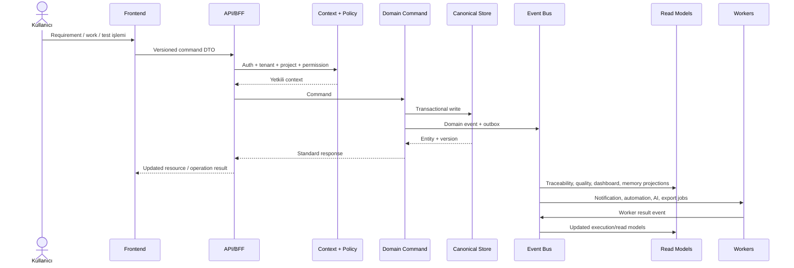

# Nexa Ana Modüller, İlişkiler ve Hedef Mimari

## 1. Dokümanın amacı

Bu doküman Nexa uygulamasındaki proje içi 14 ana modülün:

- ne amaçla kullanıldığını,
- hangi iş nesnelerini ürettiğini veya tükettiğini,
- diğer modüllerle nasıl ilişkilendiğini,
- mevcut kod tabanındaki karşılığını,
- mevcut durumdan hedef duruma geçerken hangi boşlukların kapatılması gerektiğini

tanımlar.

Buradaki “ana modül” tanımı, mevcut frontend proje navigasyonundaki `PROJECT_SECTIONS` sözleşmesine dayanır. Bu nedenle Dashboard, Service Desk, Portfolio, Admin/Security ve benzeri uygulama-geneli özellikler ayrıca “platform modülü” olarak ele alınmıştır; 14 sayısına dahil edilmemiştir.

## 2. Kapsam ve mevcut kaynaklar

Ana modül sözleşmesi şu dosyalarda görünür:

- Frontend modül listesi ve URL eşlemesi: [`frontend/src/lib/routes.ts`](../frontend/src/lib/routes.ts)
- Proje sekmelerinin ekranlara bağlanması: [`frontend/src/pages/projects/ProjectDetailsPage.tsx`](../frontend/src/pages/projects/ProjectDetailsPage.tsx)
- Global ve proje navigasyon grupları: [`frontend/src/components/AppShell.tsx`](../frontend/src/components/AppShell.tsx)
- Backend route agregasyonu: [`backend/src/routes/index.ts`](../backend/src/routes/index.ts)
- Servis ve controller katmanları: [`backend/src/services`](../backend/src/services) ve [`backend/src/controllers`](../backend/src/controllers)
- Üretim ve operasyon gereksinimleri: [`docs/PRODUCTION_READINESS.md`](./PRODUCTION_READINESS.md)

## 3. Modül envanteri

| # | Ana modül | Frontend section/tab | Ana iş nesneleri | Birincil çıktısı |
|---:|---|---|---|---|
| 1 | Backlog | `backlog` | Requirement, Epic, Story, Task, Bug, Comment, Tag | Planlanabilir ve takip edilebilir iş kapsamı |
| 2 | Board | `board` | Work item, Board column, Workflow, Transition | İşlerin durum bazlı yürütülmesi |
| 3 | Milestones | `milestones` | Milestone | Zaman ve teslimat hedefleri |
| 4 | Test Cases | `tests` / `test-cases` | Test suite, Test case, Test step | Tekrar çalıştırılabilir doğrulama tanımı |
| 5 | Test Runs | `runs` | Test run, Run item, Test result | Gerçekleşmiş test kanıtı ve sonuçları |
| 6 | Automation | `automation` | Automation step, Scenario, API step, Coverage | Otomatik çalıştırma ve otomasyon kapsamı |
| 7 | Traceability | `traceability` | Requirement/Work item/Test case/Run/Release bağlantıları | Uçtan uca izlenebilirlik matrisi |
| 8 | Timesheet | `timesheet` | Worklog, Duration, Category | Harcanan zaman ve kapasite verisi |
| 9 | Quality | `quality` | Quality metric, Gate, Risk, Coverage, Failure | Kalite görünümü ve release karar girdisi |
| 10 | Wiki | `wiki` | Wiki space, Wiki page, Revision | Onaylanabilir proje dokümantasyonu |
| 11 | Project Memory | `memory` / `project-memory` | Knowledge item, Embedding, Source reference | AI ve ekip için aranabilir proje bağlamı |
| 12 | AI Analyst | `ai` / `ai-analyst` | Business request, AI job, Generated story/test/step | Talep analizi ve üretken iş akışı |
| 13 | Releases | `releases` | Release candidate, Approval round, Decision, Deploy package | Kontrollü sürüm ve yayın kararı |
| 14 | Settings | `settings` | Project member, Integration, Environment, Policy | Projenin çalışma kuralları ve erişim ayarları |

## 4. Modül grupları

Mevcut frontend navigasyonu modülleri dört grupta sunuyor. Bu gruplama hedef mimaride de korunmalı; ancak veri ve izin ilişkileri ortak bir omurgaya alınmalıdır.



## 5. Mevcut uçtan uca iş akışı

Uygulamanın ana değeri, tek bir iş nesnesinin planlama, geliştirme, test, kalite ve release sürecinden geçebilmesidir. Mevcut kodda bu ilişki farklı route ve servis gruplarıyla kurulmuş durumdadır.



### Mevcut akışın yorumu

Mevcut yapı bu akışı UI seviyesinde görünür kılıyor. `ProjectDetailsPage` içinde Backlog, Board, Test Cases, Test Runs, Automation, Traceability, Timesheet, Quality, Wiki, AI Analyst, Project Memory, Releases ve Settings ayrı sekmelere bağlanmış durumda.

Ancak ilişki kurallarının önemli bir kısmı merkezi bir domain graph veya ortak workflow katmanı yerine ilgili servis/controller içerisinde tutuluyor. Bu nedenle bir nesnenin başka modülde görünmesi çoğunlukla:

- `projectId` üzerinden sorgu yapılmasına,
- ilgili endpoint’in doğru resolver ve permission ile çağrılmasına,
- servislerin aynı entity ve status varsayımlarını paylaşmasına

bağlıdır.

## 6. Modül tanımları ve mevcut-hedef karşılaştırması

### 6.1 Backlog

#### Amaç

Backlog, proje kapsamındaki yapılacak işleri ve iş taleplerini yönetir. İşin ne olduğunu, neden yapıldığını, önceliğini, türünü, sorumlusunu ve mevcut durumunu kayıt altına alır.

#### Modül ilişkileri

- Requirement veya Business Request, backlog kapsamının üst seviye kaynağıdır.
- Epic, Story, Task ve Bug board üzerinde yürütülen çalışma birimleridir.
- Test Case, iş maddesinin kabul ve doğrulama kapsamını oluşturur.
- Comment, Tag ve Attachment iş maddesinin bağlamsal kanıtlarını taşır.
- Milestone, Sprint ve Release iş maddelerini zaman veya teslimat kapsamına bağlar.
- Traceability, backlog kaydını test ve release kanıtına bağlar.

#### Mevcut durum

- `work-items` route grubu ile genel iş maddesi API’si vardır.
- `epics`, `stories`, `tasks` ve `bugs` için geriye dönük alias route’lar da vardır.
- NQL arama, yorum, etiket ve business request route’ları bulunur.
- Requirement API’si backlog permission’larını miras alır.
- Aynı domain için hem eski tür bazlı route’lar hem de yeni `/work-items` route’ları birlikte yaşamaktadır.

#### Hedef durum

Backlog tek bir canonical `WorkItem` domain API’sine indirgenmeli; türler (`EPIC`, `STORY`, `TASK`, `BUG`) aynı lifecycle, authorization, audit, history ve traceability sözleşmesini kullanmalıdır. Alias route’lar bir süre compatibility katmanında kalabilir, ancak yeni geliştirmeler canonical API’ye yapılmalıdır.

#### Mevcut → hedef farkı

| Konu | Mevcut | Hedef |
|---|---|---|
| API | Canonical route + alias route’lar | Tek canonical WorkItem API |
| Durum geçişi | Bazı akışlar servis bazlı | Ortak state machine ve transition policy |
| Yetki | Route ve servislerde dağınık | Ortak project/organization policy |
| İzlenebilirlik | İlişki bazı akışlarda opsiyonel | Requirement → WorkItem → Test → Release zorunlu graph bağlantıları |
| Geçmiş | Bazı entity’lerde farklı davranış | Tüm değişikliklerde ortak history ve audit |

### 6.2 Board

#### Amaç

Board, backlog’daki işlerin akış durumlarını görselleştirir ve ekip üyelerinin işleri kolonlar arasında ilerletmesini sağlar.

#### Modül ilişkileri

- Backlog’dan work item alır.
- Board columns, workflow status’larının görsel karşılığıdır.
- Sprint ve Milestone, board görünümüne zaman/kapsam filtresi sağlar.
- Timesheet, board üzerindeki çalışma ile geçirilen zamanı ilişkilendirir.
- Quality ve Release, board tamamlanma durumunu karar girdisi olarak kullanır.

#### Mevcut durum

- Agile board ve item move route’ları vardır.
- Board column oluşturma, template uygulama, sıralama ve policy route’ları bulunur.
- Workflow scheme draft/publish akışları eklenmiştir.
- Board erişiminde project resolver ve permission kullanımı vardır.

#### Hedef durum

Board, workflow scheme’in tek tüketicisi değil, workflow state machine’in görsel istemcisi olmalıdır. Bir item’ın board’da taşınması ile API üzerinden status güncellemesi aynı transition command’ını çalıştırmalı; audit, validation, notification ve action-center event’i tek noktadan üretilmelidir.

### 6.3 Milestones

#### Amaç

Milestone, belirli bir hedef veya teslim tarihini temsil eder. Proje planının zaman odaklı görünümünü sağlar.

#### Modül ilişkileri

- Backlog ve Board işleri milestone kapsamına girer.
- Test Run ve Release Candidate milestone’a bağlanabilir.
- Dashboard ve Quality, milestone ilerlemesini raporlayabilir.
- Timesheet, milestone hedefi ile harcanan eforu karşılaştırır.

#### Mevcut durum

- CRUD, restore ve project-scoped listeleme endpoint’leri vardır.
- Test run validation modelinde milestone bağlantısı bulunur.
- UI’da proje içi milestone listesi ve global milestone ekranı vardır.

#### Hedef durum

Milestone, yalnızca tarih alanı olan bağımsız kayıt değil; kapsam, hedef metrik, bağlı work item, test run, risk ve release durumunu içeren bir teslimat nesnesi olmalıdır. Tamamlanma yüzdesi tek bir servis tarafından hesaplanmalı ve Dashboard, Quality, Reports ile aynı hesap kullanılmalıdır.

### 6.4 Test Cases

#### Amaç

Test Cases, bir işin beklenen davranışını tekrar çalıştırılabilir adımlar ve beklenen sonuçlarla tanımlar. Manuel ve otomatik test yürütmenin temel kaynağıdır.

#### Modül ilişkileri

- Suite, test case’leri hiyerarşik olarak gruplar.
- Test Case, Requirement veya Work Item ile ilişkilendirilir.
- Test Run, test case’in belirli bir koşum içindeki kopyasını/run item’ını oluşturur.
- Automation, test case adımlarından otomasyon senaryosu üretir.
- Test Result, test case’in gerçek koşum sonucunu taşır.
- Traceability ve Quality, case kapsamını ve sonuçlarını kullanır.

#### Mevcut durum

- Suite ve case CRUD, restore, history, approve, revision, move, tag ve bulk işlemleri vardır.
- Case adımları `action` ve `expected` alanlarıyla modellenir.
- Test case status’ları `DRAFT`, `PENDING`, `APPROVED`, `REVISE` olarak tanımlanmıştır.
- Test case ve suite erişimleri project-scoped permission’larla korunmaktadır.

#### Hedef durum

Test case lifecycle’ı requirement lifecycle ve release policy ile bağlanmalı; onaysız veya revize durumundaki case’lerin production release gate’ine yanlışlıkla dahil edilmesi engellenmelidir. Step değişikliği ile case version’ı, automation senaryosu ve geçmiş kaydı atomik olarak güncellenmelidir.

### 6.5 Test Runs

#### Amaç

Test Runs, belirli bir zaman, ortam ve kapsam için test case’lerin çalıştırılmasını ve sonuçlarının saklanmasını sağlar.

#### Modül ilişkileri

- Test Suite veya project kapsamından case seçer.
- Manual veya Automation ile yürütülür.
- Her case için run item üretir.
- Run item, Test Result ve kanıt dosyalarıyla sonuçlanır.
- Quality, Traceability, Reports ve Release gate sonuçları tüketir.
- Timesheet, koşum ve düzeltme eforunu destekler.

#### Mevcut durum

- Run oluşturma, listeleme, detay, conflict, report, comparison, export ve automation trigger endpoint’leri vardır.
- Manual, automation ve item trigger akışları ayrılmıştır.
- Result status’ları `PASS`, `FAIL`, `RETEST`, `BLOCK`, `UNTESTED` olarak tanımlanmıştır.

#### Hedef durum

Run, immutable bir execution snapshot olmalıdır. Run oluşturulduğu anda case versiyonu, environment, code/release context ve test data snapshot’ı kaydedilmelidir. Sonuç güncellemeleri idempotent command olarak işlenmeli; aynı run item’a iki farklı sonuç yazıldığında yarış koşulu oluşmamalıdır.

### 6.6 Automation

#### Amaç

Automation, test case veya kullanıcı tanımından tekrar çalıştırılabilir UI/API otomasyonları üretir, çalıştırır ve sonuçlarını test run’a aktarır.

#### Modül ilişkileri

- Test Cases, automation senaryosunun iş anlamını sağlar.
- Automation Steps, senaryonun teknik adımlarını oluşturur.
- API Automation, HTTP request ve assertion çalıştırır.
- Run, otomasyon yürütmesinin yaşam döngüsünü taşır.
- Storage, video, screenshot ve artifact saklar.
- Quality, automation pass/fail ve coverage oranlarını kullanır.
- Project Memory ve AI Analyst, step önerisi ve locator üretiminde bağlam sağlar.

#### Mevcut durum

- Automation step/scenario, dry-run, live frame, cleanup-video ve coverage route’ları vardır.
- Playwright executor, API executor, BullMQ queue ve Browserless entegrasyonları bulunmaktadır.
- Root seviyede oluşturulan API automation projesi backend route’larından 397 operasyonu test edecek şekilde yapılandırılmıştır.

#### Hedef durum

Automation güvenlik ve yönetişim sınırları belirlenmiş bir execution platformu olmalıdır:

- URL allowlist ve SSRF koruması,
- domain/proje bazlı kota,
- response ve artifact boyut sınırı,
- secret redaction,
- sandbox edilmiş Browserless/worker yürütmesi,
- idempotent job ve retry politikası,
- run item ile zorunlu execution correlation ID.

### 6.7 Traceability

#### Amaç

Traceability, bir gereksinimin hangi iş maddeleriyle, test case’lerle, test sonuçlarıyla ve release kararıyla doğrulandığını gösterir.

#### Modül ilişkileri

Traceability diğer modüllerin üstüne kurulan bir raporlama ve ilişki katmanıdır:



#### Mevcut durum

- Project analytics altında `traceability` ve `quality` endpoint’leri vardır.
- Requirement ve work item domain’leri ayrı servis/route grupları olarak bulunur.
- Test, run, release ve quality verilerinin bir kısmı ortak `projectId` ile birleştirilir.

#### Hedef durum

Traceability, sonradan hesaplanan ekran değil, entity ilişki sözleşmesinin merkezi olmalıdır. Her ilişki:

- kaynak ve hedef entity türünü,
- kaynak ve hedef ID’yi,
- ilişki türünü,
- oluşturan kullanıcıyı,
- oluşturulma/değişme zamanını,
- geçerlilik ve audit durumunu

taşımalıdır. Böylece “test edildi mi?” sorusu yalnızca sayım değil, kanıt zinciriyle cevaplanabilir.

### 6.8 Timesheet

#### Amaç

Timesheet, kullanıcıların iş maddesi, test, release veya genel proje faaliyetleri için harcadığı zamanı ölçer.

#### Modül ilişkileri

- Work Item, doğrudan çalışma kaydının ana hedefidir.
- Board, aktif iş ve durum bağlamını sağlar.
- Test Run, test yürütme ve hata düzeltme eforunu üretir.
- Milestone ve Release, planlanan ve gerçekleşen eforu karşılaştırır.
- Portfolio ve Dashboard, kapasite/teslimat göstergelerine dönüştürür.

#### Mevcut durum

- Worklog create, update, delete, list, weekly summary ve timesheet endpoint’leri vardır.
- UI’da project-specific Timesheet tabı ve global time tracker bulunur.
- Sprint planning tarafında kapasite ve worklog ilişkileri için servisler mevcuttur.

#### Hedef durum

Timesheet kayıtları yalnızca serbest süre girişi olmaktan çıkarılmalı; timer event, work item, test run ve release bağlamı ile aynı zaman çizelgesinde birleşmelidir. Düzenleme/silme işlemleri audit’li olmalı ve kapatılmış milestone/release dönemlerinde geriye dönük değişiklik politikaya bağlanmalıdır.

### 6.9 Quality

#### Amaç

Quality, test sonuçlarını, otomasyon kapsamını, traceability boşluklarını, riskleri ve release readiness kriterlerini tek bir karar görünümünde birleştirir.

#### Modül ilişkileri

- Test Runs ve Test Results kalite kanıtının temel kaynağıdır.
- Automation coverage otomatik doğrulama seviyesini gösterir.
- Traceability, kapsam boşluklarını gösterir.
- Backlog bug’ları risk ve trend verisi sağlar.
- Release, quality gate kararını tüketir.
- Dashboard ve Reports kalite görünümünü dışarı sunar.

#### Mevcut durum

- Project analytics altında quality dashboard endpoint’i vardır.
- Release eligibility, risk analizi, approval round ve quality tier route’ları vardır.
- Quality puanlama modeli ayrıca [`docs/KALITE-PUANLAMA-MODELI.md`](./KALITE-PUANLAMA-MODELI.md) içinde tanımlıdır.

#### Hedef durum

Quality bir dashboard değil, deterministik bir policy engine olmalıdır. Aynı release kapsamı ve kanıt seti her ortamda aynı sonucu üretmelidir. AI yalnızca açıklama ve öneri sunmalı; pass oranı, kritik bug, coverage ve traceability gate’lerini değiştirememelidir.

### 6.10 Wiki

#### Amaç

Wiki, proje bilgisini alanlara ve sayfalara bölerek ekip tarafından okunabilir, düzenlenebilir ve onaylanabilir hale getirir.

#### Modül ilişkileri

- Project Settings, wiki alanlarının sahipliğini ve erişimini belirler.
- Backlog, test ve release kayıtları wiki sayfalarına bağlanabilir.
- Project Memory, onaylanmış wiki içeriğini AI aranabilir bilgiye dönüştürür.
- AI Analyst, wiki kapsamı ve mimari soruları için içerik üretir.
- Storage, wiki ek dosyalarını tutar.

#### Mevcut durum

- Wiki space ve page oluşturma, listeleme, güncelleme, status, restore ve tree endpoint’leri vardır.
- Wiki status modeli ile onaylanmış içerik ayrımı yapılmaktadır.
- Knowledge sync servisinin yalnızca onaylı wiki sayfalarını indekslemesi amaçlanmıştır.

#### Hedef durum

Wiki revizyon, onay ve bilgi yaşam döngüsü ayrımını açıkça taşımalıdır. Draft içerik çalışma alanında kalmalı; Project Memory’ye yalnızca onaylı ve geçerli revizyon aktarılmalıdır. Wiki link’leri entity graph’ın birinci sınıf ilişkisi olmalıdır.

### 6.11 Project Memory

#### Amaç

Project Memory, proje içindeki onaylı bilgi ve iş bağlamını AI ve ekip araması için kaynaklı, aranabilir bir bilgi katmanına dönüştürür.

#### Modül ilişkileri

- Wiki, memory’nin ana bilgi kaynağıdır.
- Requirement, Work Item, Test Case ve Release kayıtları ek kaynaklardır.
- AI Analyst, memory üzerinden context retrieval yapar.
- Kullanıcı cevaplarında source reference ve entity bağlantısı gösterilir.
- Project Settings, hangi kaynakların indeksleneceğini belirler.

#### Mevcut durum

- Knowledge service, vector search, project knowledge count ve sync akışları vardır.
- Project Assistant UI, proje içi konuşma ve kaynak gösterimi için kullanılır.
- AI route’larında knowledge sync ve chat endpoint’leri vardır.
- Mevcut audit raporu, bazı knowledge kapsamlarının doğru entity filtreleriyle sınırlandırılması gerektiğini vurgular.

#### Hedef durum

Memory, ayrı ve kontrolsüz bir kopya değil, kaynak entity’lerin versiyonlu projection’ı olmalıdır. Her embedding kaydı kaynak entity, source version, visibility, organization ve project scope taşımalı; kaynak silindiğinde veya erişimi değiştiğinde indeks de güncellenmelidir.

### 6.12 AI Analyst

#### Amaç

AI Analyst, iş talebini analiz eder; kapsam, mimari, backlog, test adımı ve yardımcı cevaplar üretir.

#### Modül ilişkileri

- Business Request/Requirement giriş kaynağıdır.
- Project Memory context sağlayarak halüsinasyon riskini azaltır.
- Backlog, AI tarafından üretilen epic/story/task hedefidir.
- Test Cases, story’den üretilen test tanımlarını alır.
- Automation, AI tarafından önerilen adımları çalıştırılabilir hale getirir.
- Release ve Quality, AI risk analizi için veri sağlar.

#### Mevcut durum

- `generate-stories`, `generate-steps`, `generate-tests-from-story`, `analyze`, `chat`, `sync-knowledge`, `extract-elements` gibi AI endpoint’leri vardır.
- Queue/worker tabanlı AI job yürütme yapısı vardır.
- Business request analyze/approve akışı bulunur.
- API Automation Studio doğal dilden API step üretebilmektedir.

#### Hedef durum

AI çıktısı doğrudan üretim verisi olmamalıdır. Her AI job:

1. kaynak kapsam ve kullanıcı ile ilişkilendirilmeli,
2. kullanılan memory kaynaklarını kaydetmeli,
3. prompt/model/version bilgisini audit etmeli,
4. öneri ve uygulanmış değişikliği ayırmalı,
5. kullanıcı onayı olmadan backlog, test veya release kararını değiştirmemelidir.

### 6.13 Releases

#### Amaç

Releases, bir veya birden fazla projenin belirli kapsamını kalite kanıtlarıyla birlikte yayınlanabilir bir aday haline getirir ve karar sürecini yönetir.

#### Modül ilişkileri

- Backlog, release kapsamındaki işleri sağlar.
- Milestones ve Sprints teslimat zamanlamasını sağlar.
- Test Runs ve Quality, release readiness kanıtıdır.
- Traceability, kapsamın eksiksiz doğrulanıp doğrulanmadığını gösterir.
- Approval rounds ve Decisions yönetişim kaydıdır.
- Follow-up items, release kararından doğan yeni backlog kayıtlarıdır.
- Deploy package, yayınlama çıktısıdır.

#### Mevcut durum

- Project-scoped release candidate CRUD ve kalite tier endpoint’leri vardır.
- Governance state, approval rounds, decisions, follow-ups, deploy packages, AI summary ve eligibility endpoint’leri bulunur.
- Action Center release kaynaklı takip işlerini gösterebilir.

#### Hedef durum

Release Candidate immutable scope snapshot ile oluşturulmalıdır. Sonradan work item veya test case değiştiğinde adayın kapsam versiyonu değişmemeli; yeni bir revision veya yeniden değerlendirme üretilmelidir. Release finalize işlemi kalite policy, risk, audit ve approval quorum kontrollerini tek transaction/command içinde yürütmelidir.

### 6.14 Settings

#### Amaç

Settings, projenin kimlerin erişebildiğini, hangi kurallarla çalıştığını, hangi entegrasyonları kullandığını ve hangi environment’lara deploy edilebileceğini belirler.

#### Modül ilişkileri

- Tüm proje modülleri Settings’teki organization/project üyelik ve permission bağlamına bağlıdır.
- Board ve Workflow, durum ve geçiş politikalarını tüketir.
- Automation, environment ve entegrasyon ayarlarını kullanır.
- Release, environment, quality tier ve approval policy’lerini kullanır.
- Wiki, Memory ve Storage veri erişim kurallarına bağlıdır.

#### Mevcut durum

- Project members, integrations, environments, board columns, work item policies ve workflow scheme için route/service grupları vardır.
- Auth/RBAC middleware ve project resolver’lar birçok endpoint’te kullanılır.
- Admin seviyesinde kullanıcı, audit, enterprise security ve operational readiness ekranları bulunur.

#### Hedef durum

Settings ekranı yalnızca CRUD yüzeyi değil, merkezi policy yönetim noktası olmalıdır. Permission, tenant scope, workflow, quality gate, automation network policy, retention ve integration secret kuralları aynı policy registry’den okunmalıdır.

## 7. Modüller arası temel sözleşmeler

14 modülün sağlıklı çalışması için aşağıdaki ortak sözleşmeler hedeflenmelidir.

### 7.1 Ortak kimlik ve tenant kapsamı

Her project-scoped entity şu bağlamı taşımalıdır:

```text
organizationId
projectId
createdBy / updatedBy
visibility
deletedAt veya lifecycle status
```

İstek işleme sırası da standardize edilmelidir:



Mevcut audit raporunda tenant izolasyonu, dashboard/global search, milestone, Service Desk, Socket.IO ve ProjectAccess için çeşitli açıklar listelenmiştir. Hedef mimaride bu kontroller her modülün kendi yorumuna bırakılmamalıdır.

### 7.2 Ortak domain event omurgası

Modüller birbirini doğrudan Prisma/service çağrılarıyla tetiklemek yerine, önemli değişiklikleri domain event olarak yayınlamalıdır.

```mermaid
flowchart TB
    WorkItemCreated[WorkItemCreated]
    StatusChanged[WorkItemStatusChanged]
    CaseApproved[TestCaseApproved]
    RunFinished[TestRunFinished]
    WikiApproved[WikiPageApproved]
    ReleaseChanged[ReleaseChanged]

    WorkItemCreated --> TraceabilityProjection
    WorkItemCreated --> MemoryProjection
    WorkItemCreated --> ActionCenterProjection

    StatusChanged --> BoardProjection
    StatusChanged --> TimesheetProjection
    StatusChanged --> NotificationProjection

    CaseApproved --> AutomationProjection
    CaseApproved --> TraceabilityProjection

    RunFinished --> QualityProjection
    RunFinished --> ReleaseEligibilityProjection
    RunFinished --> ReportProjection

    WikiApproved --> MemoryProjection
    ReleaseChanged --> QualityProjection
    ReleaseChanged --> ActionCenterProjection

    TraceabilityProjection[Traceability read model]
    MemoryProjection[Project Memory index]
    ActionCenterProjection[Action Center]
    BoardProjection[Board read model]
    TimesheetProjection[Timesheet aggregation]
    NotificationProjection[Notifications]
    AutomationProjection[Automation coverage]
    QualityProjection[Quality metrics]
    ReleaseEligibilityProjection[Release eligibility]
    ReportProjection[Reports]
```



### 7.3 Ortak status ve state machine

Şu nesnelerin status geçişleri aynı yaklaşım ile tanımlanmalıdır:

- Work Item
- Requirement/Business Request
- Test Case
- Test Run
- Test Result
- Release Candidate
- Wiki Page
- Milestone

Her geçiş için `actor`, `from`, `to`, `reason`, `timestamp`, `correlationId` ve `policyVersion` kaydedilmelidir.

## 8. Mevcut mimarinin özeti

### Güçlü taraflar

- 14 proje section’ı frontend’de açıkça tanımlanmış durumda.
- ProjectDetailsPage modülleri anlaşılır bir proje bağlamında topluyor.
- Backend route’ları domainlere ayrılmış; test, automation, wiki, release ve enterprise route grupları mevcut.
- Test Case → Test Run → Test Result zinciri için gerçek entity ve endpoint katmanları var.
- Release governance, approval round, eligibility ve quality tier gibi kurumsal kavramlar modele dahil edilmiş.
- AI, knowledge, automation ve background worker altyapıları ürünün ana akışına bağlanmış.
- Geriye dönük alias route’lar frontend kırılmasını azaltıyor.

### Mevcut durumda ana yapısal sorunlar

Mevcut audit bulgularıyla da uyumlu olarak temel sorun, özellik eksikliğinden çok modüller arası sözleşmelerin aynı seviyede merkezi olmamasıdır:

1. **Tenant ve project scope tutarsızlığı:** Bazı liste ve servis akışlarında organization/project filtreleri eksik veya dağınık uygulanıyor.
2. **Yetki modeli dağınık:** Route middleware, service check ve permission catalog arasında davranış farkları oluşabiliyor.
3. **Entity ilişkileri çoğunlukla implicit:** Aynı `projectId` altında bulunmak, her zaman gerçek traceability ilişkisi anlamına gelmiyor.
4. **API yüzeyi büyümüş durumda:** Canonical work item route’ları ile tür bazlı alias route’lar birlikte yaşıyor.
5. **Response sözleşmesi tam standardize değil:** Bazı servislerde `ApiResponse` wrapper, bazı endpoint’lerde farklı şekiller kullanılıyor.
6. **State geçişleri modül bazlı:** Board, test, release ve bulk işlemlerinde ortak state machine yaklaşımı güçlendirilmeli.
7. **Background execution sınırları zayıf:** AI, automation, socket, storage ve external URL işlemlerinde ortak execution/security policy gereklidir.
8. **Projection/read model eksik:** Dashboard, quality, traceability, memory ve reports kendi sorgu/hesaplarını farklı şekillerde yapabiliyor.
9. **Transaction ve audit kapsamı eşit değil:** Özellikle history, soft delete, bulk ve release gibi kritik akışlar atomik hale getirilmeli.

## 9. Hedef mimari

Hedefte frontend’deki 14 modül görünümü korunur; backend’de ise her modül aşağıdaki ortak domain omurgasına bağlanır.



### Hedef modül sınırları

Her modül aşağıdaki katmanlara sahip olmalıdır:

```text
module/
  domain/          entity, value object, policy, state machine
  application/     commands, queries, use cases
  infrastructure/  repository, queue, external provider
  api/             controller, route, validation, DTO
  projections/     dashboard, search, traceability read models
```

Bu yapı, frontend’deki tab sayısını artırmadan backend tarafında sorumlulukların ayrışmasını sağlar.

## 10. Mevcut durum ve hedef durum karşılaştırması

| Boyut | Mevcut durum | İstenen durum | Öncelik |
|---|---|---|---|
| Modül görünürlüğü | 14 section frontend’de açıkça mevcut | Aynı 14 section, ortak capability sözleşmesiyle korunmalı | P1 |
| Proje bağlamı | Birçok endpoint’te `projectId` ve resolver var; tüm akışlar eşit değil | Her entity ve command için zorunlu organization/project context | P0 |
| Work item API’si | Canonical `/work-items` ve epics/stories/tasks/bugs alias’ları birlikte | Canonical API + versioned compatibility layer | P1 |
| Traceability | Analytics endpoint’leri ve servis hesapları mevcut | First-class, versioned entity relationship graph | P1 |
| Test zinciri | Suite → Case → Run → Result akışı mevcut | Snapshot, idempotency, immutable evidence ve release bağlamı | P0 |
| Automation | UI/API executor, queue ve Browserless mevcut | Sandbox, SSRF koruması, kota, secret redaction, correlation | P0 |
| AI | Story/step/chat/analysis üretimi mevcut | Kaynaklı, onaylı, versiyonlu ve audit’li öneri/apply ayrımı | P1 |
| Wiki/Memory | Wiki sync ve vector search mevcut | Source-version projection, visibility ve erişim senkronizasyonu | P1 |
| Quality | Dashboard, quality score ve release eligibility mevcut | Tek deterministik policy engine | P0 |
| Release | Governance, approval, decision, package route’ları mevcut | Immutable scope snapshot ve atomik finalize command | P0 |
| State yönetimi | Modül bazlı status akışları | Ortak state machine, transition event ve policy version | P1 |
| Audit | Audit servisleri ve audit route’ları mevcut | Tüm command/event geçişlerinde immutable evidence | P0 |
| API sözleşmesi | Bazı response wrapper ve servis davranışları farklı | Versioned DTO, ortak error/response contract | P1 |
| Read modeller | Dashboard/report/quality/traceability sorguları dağınık | Event-driven projection ve ortak metric hesapları | P1 |
| Transaction | Bazı update/bulk/restore işlemleri atomik değil | Kritik use case’lerde transaction + outbox | P0 |
| Operasyon | Worker, Redis, MinIO, Browserless ve AI bağımlılıkları mevcut | Health, retry, dead-letter, timeout, quota ve observability standardı | P0 |

## 11. Hedeflenen ideal iş akışı



## 12. Önerilen geçiş planı

### Faz 0 — Güvenlik ve veri sınırı

1. Tüm project-scoped sorgularda organization + project access kontrolünü zorunlu hale getir.
2. Ortak `RequestContext` ve `ProjectAccess` kullanımını tüm modüllerde standardize et.
3. Automation/API execution için URL allowlist, private IP engeli, response limit ve secret redaction ekle.
4. Socket, Storage, Service Desk ve dashboard/global search kapsamlarını tenant bazında düzelt.
5. Kritik işlemlerde audit ve correlation ID zorunluluğu getir.

### Faz 1 — Canonical domain sözleşmeleri

1. `WorkItem` canonical API’sini belirle; alias route’ları compatibility katmanına taşı.
2. Ortak `ApiResponse`, `ApiError`, pagination ve validation sözleşmesini tüm endpoint’lere uygula.
3. Test Case, Test Run, Result ve Release status geçişlerini ortak state machine’e taşı.
4. Soft delete, restore, history ve bulk işlemlerini transaction içine al.
5. Traceability ilişki tiplerini ve entity graph modelini tanımla.

### Faz 2 — Event ve projection katmanı

1. Outbox/event bus altyapısını kur.
2. Quality, Traceability, Dashboard, Reports, Action Center ve Project Memory için read model üret.
3. Milestone, Timesheet ve Release metriklerini aynı projection/metric kütüphanesine taşı.
4. AI context ve automation coverage projection’larını event’lerden besle.

### Faz 3 — Ürün deneyimi ve yönetişim

1. Her modül için capability/permission matrix’i UI ile aynı kaynaktan üret.
2. AI önerilerini draft/approval/apply olarak ayır.
3. Release finalize işleminde quality gate, approval quorum ve evidence snapshot’ı zorunlu kıl.
4. Module-level API contract testleri ve kritik akışlar için E2E testlerini CI kalite kapısı yap.
5. Gözlemlenebilirlik panellerinde modül bazlı latency, error rate, queue delay ve data freshness ölç.

## 13. Başarı ölçütleri

Hedef mimarinin tamamlandığını söylemek için aşağıdaki ölçütler karşılanmalıdır:

- Her project-scoped endpoint farklı organization ve project verisini izole eder.
- Aynı work item status geçişi UI, REST ve worker üzerinden aynı policy’yi çalıştırır.
- Her release candidate, oluşturulduğu andaki kapsam ve test kanıtını yeniden üretilebilir şekilde taşır.
- Bir requirement için bağlı work item, test case, run result ve release kararına ulaşılabilir.
- Quality sonucu aynı input kanıtlarıyla her çalıştırmada deterministiktir.
- Wiki/Memory erişimi kaynak entity izinleriyle aynı anda değişir.
- AI cevabı kaynaklarını, model/prompt sürümünü ve kullanıcı onayını kaybetmez.
- Automation dış URL, dosya ve browser işlemlerini güvenli sınırlar içinde çalıştırır.
- Kritik command’lar transaction, outbox, audit ve correlation ID ile izlenebilir.
- API contract testleri 5xx, yanlış tenant, yanlış rol, invalid state ve concurrency durumlarını CI’da yakalar.

## 14. Sonuç

Nexa’nın mevcut ana modül yapısı ürün kapsamı açısından güçlüdür: planlama, geliştirme, test, otomasyon, kalite, bilgi yönetimi ve release yönetişimi aynı proje deneyimi içinde yer almaktadır.

Mevcut durum ile hedef durum arasındaki temel fark yeni ekran eksikliği değildir. Asıl fark, modüllerin ortak bir domain omurgası üzerinde ne kadar tutarlı çalıştığıdır. Hedeflenen yapı:

```text
Ortak context
  → ortak permission/policy
    → canonical domain command
      → transactional store
        → domain event
          → traceability / quality / dashboard / memory projection
```

Bu omurga kurulduğunda 14 modül ayrı ekranlar olmaktan çıkar; aynı proje yaşam döngüsünün güvenli, ölçülebilir ve izlenebilir parçaları haline gelir.
