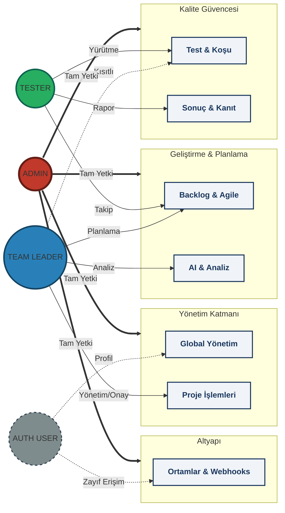

# Authorization Overview

This diagram provides a high-contrast, vivid visualization of the platform roles and their corresponding access levels.

## Rol ve Yetki Özeti

| Rol | Renk | Temel Sorumluluk |
| :--- | :--- | :--- |
| **ADMIN** | Turuncu | Tüm sistem, kullanıcı ve global ayarlar üzerinde tam kontrol. |
| **TEAM LEADER** | Mavi | Proje yönetimi, üyelikler, release kararları ve AI analizleri. |
| **TESTER** | Yeşil | Test süreçleri, senaryo yazımı, koşu yürütme ve hata takibi. |
| **AUTH USER** | Gri | Temel profil işlemleri ve (şu anki zayıflıklar nedeniyle) sınırlı altyapı erişimi. |

> [!TIP]
> Metinlerin daha okunaklı olması için arka plan renkleri canlı (Vivid), yazı tipleri ise yüksek kontrastlı (Beyaz/Siyah) seçilmiştir.
